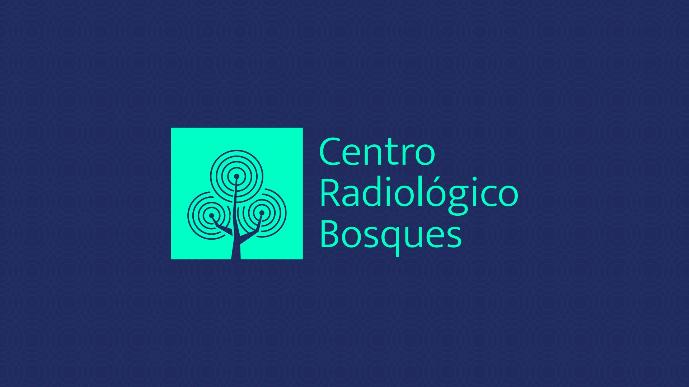
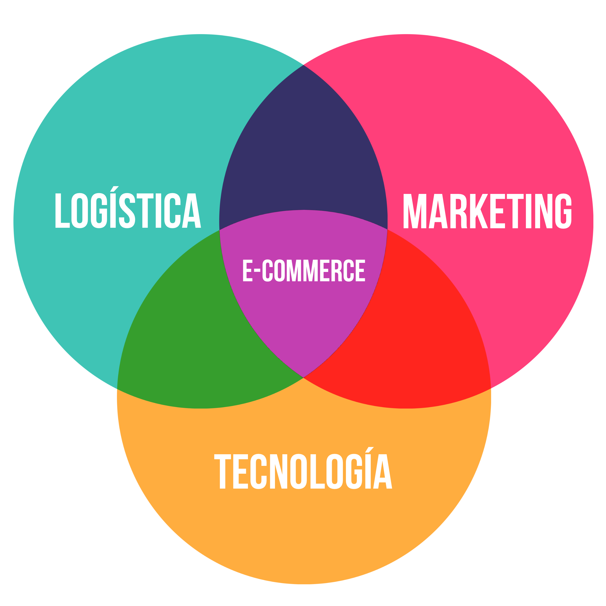
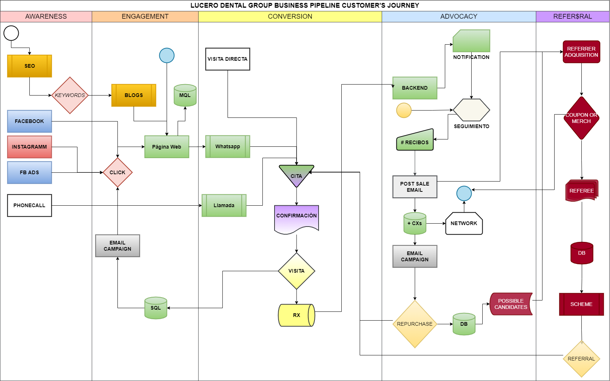
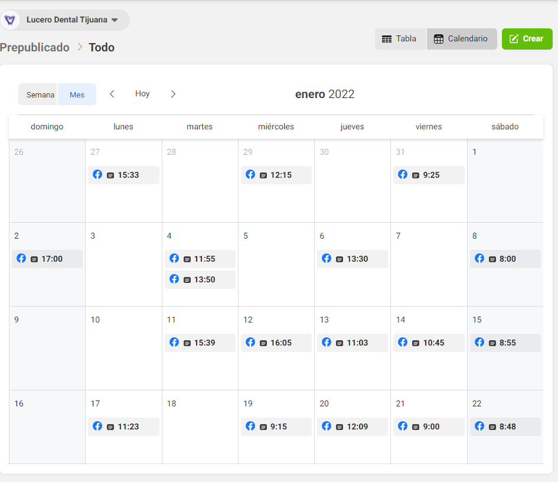
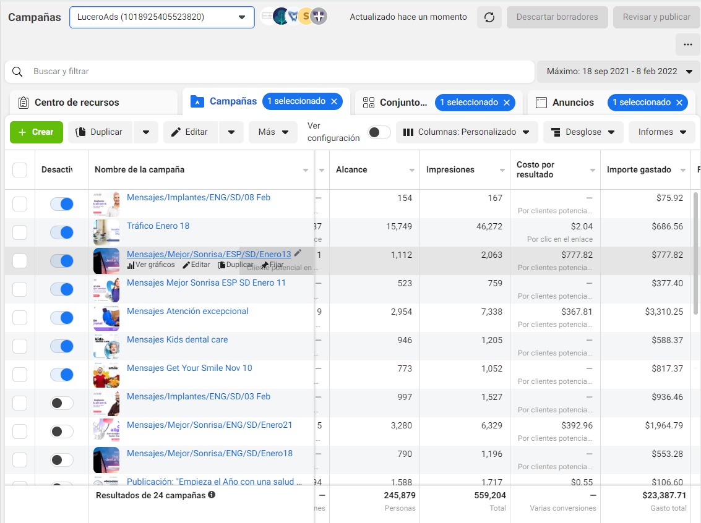
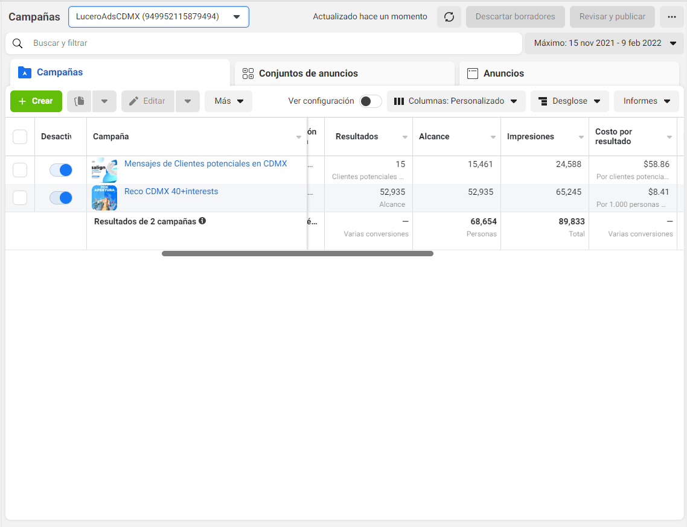

---
<<<<<<< HEAD
title: "Ecommetrics2"
author: "Juan M. Gonzalez Castillo"
date: "`r format(Sys.time(), '%d %B %Y')`"
output:
  html_document:
    toc: yes
    toc_depth: '2'
    toc_float:
      collapsed: no
      number_sections: yes
      smooth_scroll: no

---


<style>
 #TOC {
  color: #708090;
  font-family: Calibri;
  font-size: 16px; 
  border-color: #708090;
}
 #header {
  color: #F08080;
  background-color: #F5F5F5;
  opacity: 0.6;
  font-family: Calibri;
  font-size: 80px;
}
h2.title {
  color: #F08080;
  background-color: #fff9ed;
  opacity: 0.6;
  font-family: Calibri;
  font-size: 50px;
}
h3.subtitle{
  color: #F08080;
  background-color: #F5F5F5;
  opacity: 0.6;
  font-family: Calibri;
  font-size: 30px;
}
h4.author {
  color: #708090;
  font-family: Calibri;
  background-color: #F5F5F5;
}
h4.date {
  color: #708090;  
  font-family: Calibri;
  background-color: #F5F5F5;
}
body {
  color: #708090;
  font-family: Calibri;
  background-color: #F5F5F5;
  font-size: 25px;
  text-align: justify;
}
pre {
  color: #708090;
  background-color: #F8F8FF;
}
</style>


```{r Initialsetup, eval=FALSE, message=FALSE, warning=FALSE, include=FALSE}
#rm(list = ls())
libs <- c("dplyr", "plm",  "stargazer","ggplot2","readxl","tidyr", "tibble","directlabels", "ggthemes", "RColorBrewer", "knitr", "stringr","sjPlot", "sjmisc", "sjlabelled",'tinytex',"usethis", "knit")
for (i in libs) {
  if(!is.element(i,.packages(all.available = TRUE))) {
    install.packages(i,repos="https://cran.revolutionanalytics.com/")
  }
  library(i,character.only = TRUE)
}

```
```{r Markdownsetup, include=FALSE}
rmarkdown:::site_skeleton(getwd())
knitr::opts_chunk$set(fig.align = 'center', out.width="90%", echo = TRUE)
#install.packages("rlang")
#detach(package:plyr)
#install.packages('tinytex')
#tinytex::install_tinytex()  # install TinyTeX
#
#sapply(ls(),FUN = function(x){class(get(x))[[1]]})

```
```{r Datasets, echo=FALSE, message=FALSE, warning=FALSE}
#PDINEGI<-read.csv("PDINEGI.csv", header = TRUE)
#PDINEGI<-pdata.frame(PDINEGI,c("estado","yr"))

#PDWDI$yr<-as.numeric(as.character(PDWDI$yr))
#sapply(ls(),FUN = function(x){class(get(x))[[1]]})
#sapply(c(PDINEGI, PDWDI, VA.PIB.INEGI), class)
```

# __PORTFOLIO__ {#headid}

{width=900px}
&nbsp;

## Portafolio de negocios de Lucero Dental Group

&nbsp;

La consultoría de negocios de e-commetrics te resuelve el dilema digital\

¿Cómo vender los siguientes servicios...

  - Implantes
  - Endodoncia
  - Implantes
  - Endodoncia
  - Ortodoncia
  - Odontopediatría
  - Protesis
  - Limpiezas
  - Coronas
  - Odontología General e Integral
  - Odontología Cosmética

&nbsp;
  [... en línea.]{style="float:right"}

<p>&nbsp;</p>
<p>&nbsp;</p>

{width=900px}
&nbsp;

Siguiendo un plan y esquema de trabajo ya probado y estructurado, atravesamos las genialidades necesarias para construir o actualizar las plataformas digitales necesarias sostener un negocio en línea que, al final de su proceso, nos otorga una capacidad de operación sólida para el posicionamiento de un negocio.\

Para dos consultorios dentales en dos ciudades distintas.\

La estrategia se contruye para obtener clientes en ambientes digitales y convertirlos en pacientes.\

<p>&nbsp;</p>

## Objetivos de la estrategia

**Una capacidad digital para que ambos consultorios de Lucero Dental Group estén posicionados digitalmente en CDMX y Tijuana respectivamente.**\


### Lucero Dental Group

{width=400px}
{width=400px}
<p>&nbsp;</p>

### Centro Radiológico Bosques

**Incorporar la estrategia digital a Centro Radiológico Bosques iniciando con su +Branding**\

{width=700px}
&nbsp;


# __E-COMMERCE KICKOFF & ONBOARDING PACKAGE__


  - Logísitica de un calendario de citas y suministro de materiale
  - Marketing para servicios de salud y atención al cliente
  - Tecnología digital de vanguardia

{width=700px}
&nbsp;
  
## INICIO del desarrollo del e-Commerce en Lucero Dental Group

Iniciamos contrato y factura fechada en agosto 7 de 2021

&nbsp;

  - Calendario & Esquema de trabajo [E-COMMERCE PROPOSAL](https://docs.google.com/document/d/1oXbLQP4dXrA3pL93DHzzGXm-xfyoyH2rbzMrSwZ9iek/edit?usp=sharing){#Ecommerceprop}
  <p>&nbsp;</p>
  - Acuerdo de consultoría de E-commetrics [PRIVATE](https://www.e-commetrics.com)
  <p>&nbsp;</p>
  - Digrama de GANTT para Lucero Dental Group [ACTUAL GANTT](https://docs.google.com/spreadsheets/d/1CS2NK0yqkCd_B_ixXEW8T2b1f_ZQwLcx9KcddY5OIjY/edit?usp=sharing){#GANTT}
  
&nbsp;

&nbsp;

# __MVP + ORGANIC GROWTH__

## Integración de una consultoría de negocios en E-COMMERCE
&nbsp;

  - Requerimientos técnicos [Lista](https://1drv.ms/x/s!AmO5REYvrpHJgfs6iHEP_IyL-Ku8UQ?e=RG6VDI)
<p>&nbsp;</p>
  - GANTT milestones & next steps
<p>&nbsp;</p>
  - Webpage as MVP [MVP Lucerodentalmexico.com](https://www.lucerodentalmexico.com)
<p>&nbsp;</p>
  - Primeros reportes de FB & GOOGLE [Strategic reports]()
<p>&nbsp;</p>
  - Artes y UX/UI [Lucero Marketing](https://1drv.ms/u/s!AmO5REYvrpHJge1Dtw4lJZPcDk5EBg?e=RSqUqQ){#marketing}
<p>&nbsp;</p>
  - Consultoría y entrenamiento
<p>&nbsp;</p>


# __Arquitectura estatégica en conjunto__


### Una Mayor participación en la demanda es en el ECOMMERCE
### __¿Qué lo lograremos?__


Desarrollamos un mapa estratégico que vincula los activos tangibles y los procesos críticos a la propuesta de valor al cliente y a los resultados financieros.

&nbsp;

Administración elemental

  - Planeación
  - Organización
  - Ejecución
  - Control

&nbsp;
 
 Áreas empresariales
 
  - Operaciones y Ventas
  - Finanzas
  - Comunicación y Marketing
  - Tecnología y Desarrollo


&nbsp;

Siguiendo metodologías de arquitecturas de sistemas y programación entregamos el **Mapa de Flujo de vida de los pacientes ~~clientes~~ digitales** y offline que sigue a la estrategia multicanal de **META**  ~~Facebook~~  y **Google** para afianzar una operación de Marketing digital constante con resulados y orientada al crecimiento de la afluencia de pacientes en los consultorios de Lucero Dental Group.

&nbsp;

# __MAPA DE FLUJO DEL PACIENTE__ {#Flujo}

&nbsp;\
{width=900%}

## Sabemos que problemas multisectoriales requieren dirección multidepartamental.
## Dirección orientada a equipos.
## Garantía de satisfacción

&nbsp;
{width=100%}
&nbsp;


# __META ~~Facebook~~ & GOOGLE STRATEGIES__

A partir de las necesidades de la empresas digitales es que se puede diseñar un análisis al portafolio creado bajo una una estrategia para META Business ~~FACEBOOK~~ que permita acceder a un mayor reparto del mercado, es decir posicionarse en más búsquedas a través de **las redes sociales más visitadas del mundo** META FACEBOOK, Instagram, Messenger, Whatsapp y grupos en redes sociales además de aparecer y competir por la clasificación en GOOGLE mediante la implementación de keywords para el posicionamiento en intenciones de búsqueda en el navegador y buscador más utilizados del mundo.\

## positioning = Posicionamiento\

Siendo impulsor de nuevas propuestas de valor en dos mercado digitales de la industria dental en dos geografías distintas se pretende robustecer la presencia digital y así el tráfico orgánico dentro del metaverso al cual entramos con las redes y la web 3.0. Nos integramo con el paciente a través de la tecnología.\

&nbsp;\


# __Estrategia Multicanal__ [Meta & Google](https://1drv.ms/w/s!AmO5REYvrpHJgp8D1Wcnhi5TjdBXUg?e=6ozr3S){#strategy}
&nbsp;\

## Resumen de la Estrategia en Meta (Facebook)

```text
Creación de contenido para el perfil sobre:

  1. Tratamientos
  2. Ubicación
  3. Promociones y descuentos
  4. Personal e instalaciones
  5. Otros


Creación de de contenido publicitario para LuceroAds

Enfocado en los siguientes elementos claves referentes al valor agregado que otorgamos como consultorio:

1.	Indicar sus años de experiencia en EUA y que ahora se encuentra también en MX 
2.	Incluir fotografías de las doctoras con los servicios que se promocionan 
3.	Usar las fotos de la clínica para hablar del turismo dental en Tijuana usando logos de la plaza y del hotel
```
&nbsp;\

{width=600%}
&nbsp;\

### Meta Ads Historicos al 8 Feb 2022 

{width=400%}
&nbsp;\

Observamos alcances, impresiones Costo por Resultado (CPC) vs Total (Volumen)

&nbsp;\

### MetaAds

{width=400%}
&nbsp;\


# META ADS Analytics

  | Dato | Cantidad|
  |Número de Lead Conseguidos |34 |
  |Número de Conversaciones completas | 31|
  |Número de pacientes confirmados | 2|

&nbsp;\


## SEO

### Resumen SEO [Meta & Google](https://1drv.ms/w/s!AmO5REYvrpHJgp8D1Wcnhi5TjdBXUg?e=6ozr3S)

```text

Encuentra implantes en tijuana tratamientos dentales endodoncia root canal ortodoncia calidad y seguridad en cirugía y dental lucero en new city medial

Mira como poner implantes en tijuana tratamientos dentales endodoncia root canal ortodoncia calidad y seguridad en cirugía y dental lucero en new city medial

KERWORDS:

  1.	Implantes
  2.	Ortodoncia
  3.	Tijuana
  4.	dental

```

  Blog Posts:
  GOOGLE ANALYTICS
  GOOGLE DASHBOARDS

&nbsp;\

## Sugerencias:

  - Medición a través de las 5 fuerzas de Porter y aplicar un BSC a largo plazo.
  - LEADS
  - WEBPAGE Inglés
  - CRM strategy

&nbsp;\

# __DELIVERABLES__

__Customer Flow Map__ [Flujo del paciente](#Flujo)

__Strategy__ [Estategia digital](#strategy)


Go to GANTT: [GANTT link](#GANTT)\
Go to Marketing files: [DRIVE Marketing](#Marketing)\
Go to ecommerce proposal: [Ecommerce proposal](#Ecommerceprop)\
Ver flujo del paciente: [Flujo del paciente](#Flujo)\
Ver Estrategia Multicanal: [Estategia digital](#strategy)\
Ir a Glorasio de Definiciones: [Glosario](https://docs.google.com/document/d/1FORveezfhuU7M0_TXFJl-WXumC_c8csy/edit?usp=sharing&ouid=101795512112686752530&rtpof=true&sd=true)
&nbsp;\

# PORTOLIO STATUS

|*Cuenta* | *Estatus*|
|-------------|-----|
|LDG TIJUANA | 98%|  
|LDG CDMX | 65%|  
|C R BOSQUES | 40%|  

=======
title: "About This Website"
---

More about this website.
>>>>>>> bc27370ec43c2839542bc57e10d4d809afe7c8fc
